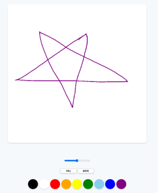
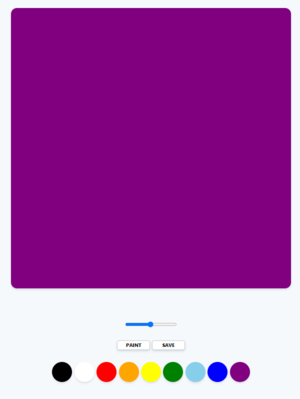

# Paint Web

### Project

- 개요 : Web에서 canvas API를 이용해 Paint 가능한 Web을 제작하였습니다.
- 언어 : HTML, CSS, JavaScript
- 기간 : 21.07.12 ~ 07.13

### 주요 기능

1. ColorButton 클릭 시 Color 변경
2. FILL 버튼 클릭 시 Canvas 배경색을 채우는 모드
3. PAINT 버튼 클릭 시 선으로 그리는 Paint 모드
4. SAVE 버튼 클릭 시 Canvas 이미지를 다운로드 받는 기능

### Screen Shot

|                PAINT Mode                |                FILL Mode                |
| :--------------------------------------: | :-------------------------------------: |
|  |  |

---

### Paint Web

Click [here](https://won-jin-lee.github.io/Paint-JS/)
